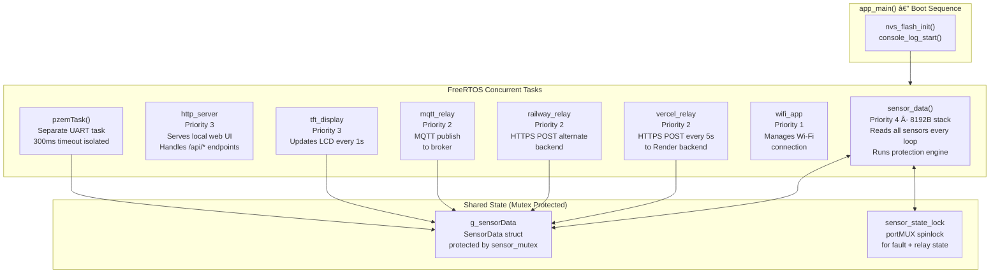

# ESP32-Based Smart Motor Retrofit and Monitoring System
### Final Year Project — Technical Report

---

## 1. System Overview

This project implements a full-stack IoT system for **real-time motor health monitoring and predictive maintenance**. A physical ESP32 microcontroller collects electrical and mechanical sensor data from a motor, relays it over Wi-Fi to a cloud backend, stores it in a managed PostgreSQL database (Neon), and exposes it through a React dashboard hosted on Vercel. Machine learning models running on the backend continuously predict faults, degradation, and remaining useful life.

---

## 2. High-Level System Architecture

```mermaid
graph TB
    subgraph EDGE["⚙️ Edge Layer — ESP32 (ESP-IDF / FreeRTOS)"]
        PZEM["PZEM-004T\nVoltage · Current · Power\nEnergy · Frequency · PF"]
        DS18["DS18B20\nMotor Temperature (°C)"]
        ADXL["ADXL345\n3-Axis Vibration\nTap Detection"]
        HALL["Hall Sensor\nRPM Measurement"]
        RELAY["Relay Module\nMotor ON/OFF"]
        BUZZER["Buzzer\nFault Alert"]
        TFT["TFT Display\nLocal Status"]
        ESP["ESP32-WROOM-32\nFreeRTOS Kernel"]
        PZEM --> ESP
        DS18 --> ESP
        ADXL --> ESP
        HALL --> ESP
        ESP --> RELAY
        ESP --> BUZZER
        ESP --> TFT
    end

    subgraph CLOUD["☁️ Cloud Layer — Render.com"]
        API["FastAPI Backend\nuvicorn · asyncpg"]
        WORKER["Redis Worker\nBackground Jobs"]
        ML["ML Pipeline\n5 Prediction Tiers"]
        API --> ML
        API --> WORKER
    end

    subgraph DB["🗄️ Database — Neon (PostgreSQL)"]
        TABLES["sensor_readings\npredictions\nfault_logs\ndevices\ncommands\nusers"]
    end

    subgraph FRONTEND["🖥️ Frontend — Vercel"]
        REACT["React 19 + Vite 8\nDashboard / Charts / AI Page"]
    end

    subgraph AI["🤖 AI Providers"]
        MISTRAL["Mistral AI\nmistral-small"]
        GEMINI["Google Gemini\ngemini-2.0-flash"]
        GROQ["Groq\nllama-3.3-70b-versatile"]
    end

    ESP --"HTTPS POST /data\n(Vercel Relay)"--> API
    ESP --"HTTPS POST /data\n(Railway Relay)"--> API
    ESP --"MQTT Publish"--> API
    API --"asyncpg SSL"--> TABLES
    REACT --"REST API + x-api-key"--> API
    ML --"Mistral → Gemini → Groq\nFallback Chain"--> AI
    TABLES --> ML
```



---

## 3. Data Flow: ESP32 → Render → Neon → Vercel

```mermaid
sequenceDiagram
    participant ESP as ESP32 (Edge)
    participant RND as Render.com (FastAPI)
    participant NEO as Neon (PostgreSQL)
    participant WKR as Redis Worker
    participant VRC as Vercel (React)
    participant OMA as Open-Meteo API

    Note over ESP: Every 5 seconds
    ESP->>RND: POST /data {SensorPayload JSON}\n+ x-api-key header

    RND->>NEO: SELECT last fault state
    NEO-->>RND: previous fault row

    RND->>OMA: GET ambient temp (lat/lon)\n[if t2 == 0]
    OMA-->>RND: temperature_2m

    RND->>NEO: INSERT sensor_readings (30+ cols)
    RND->>NEO: UPSERT devices (heartbeat)
    RND->>NEO: INSERT fault_logs (new faults only)
    RND->>NEO: UPDATE fault_logs (cleared faults)

    RND->>WKR: enqueue_prediction_job(payload)\n[background task or Redis]
    RND-->>ESP: {ok: true}

    Note over WKR: Async — non-blocking
    WKR->>NEO: SELECT historical 72h data
    NEO-->>WKR: up to 200 readings
    WKR->>WKR: Run ML Pipeline\n(Isolation Forest, RF, NASA BHI, RUL...)
    WKR->>NEO: INSERT predictions (per model)
    WKR->>NEO: DELETE predictions > 7 days

    Note over VRC: User opens dashboard
    VRC->>RND: GET /data/{device_id}
    RND->>NEO: SELECT sensor_readings
    NEO-->>RND: rows
    RND-->>VRC: JSON response

    VRC->>RND: GET /predictions/{device_id}
    RND->>NEO: SELECT predictions
    NEO-->>RND: ML results
    RND-->>VRC: predictions JSON

    Note over VRC: User clicks "Analyze"
    VRC->>RND: POST /ai/analyze/{device_id}
    RND->>RND: Mistral → Gemini → Groq fallback
    RND->>NEO: INSERT ai_comment prediction
    RND-->>VRC: {analysis, comment}
```



---

## 4. Hardware Block Diagram

```mermaid
graph LR
    subgraph PWR["Power Supply"]
        MAINS["230V AC Mains"]
    end

    subgraph MOTOR["Induction Motor"]
        MTR["Single-Phase Motor\n~230V AC"]
    end

    subgraph PROT["Protection & Control"]
        RLY["Relay Module\nGPIO26 — Active Low\nON: Motor Energised"]
        BUZ["Buzzer\nGPIO27\nFault Alert"]
    end

    subgraph SENSORS["Sensor Suite"]
        PZ["PZEM-004T\nUART2 (GPIO17 TX, GPIO16 RX)\nVoltage · Current · Power\nEnergy · Frequency · PF"]
        DS["DS18B20\n1-Wire Protocol\nMotor Temperature Sensor"]
        AX["ADXL345\nI2C (SDA/SCL)\n±16g, 3-Axis Accel\nTap Detection"]
        HS["Hall Effect Sensor\nGPIO Interrupt\nPulse Count → RPM"]
    end

    subgraph ESP32["ESP32-WROOM-32 MCU"]
        CPU["Dual-Core Xtensa LX6\n240 MHz · 4MB Flash · 520KB SRAM"]
        NVS["NVS Flash Storage\nConfig + Fault State\n+ Uptime Persistence"]
        WIFI["Wi-Fi 802.11 b/g/n\n2.4 GHz"]
    end

    subgraph DISPLAY["Local UI"]
        TFT["TFT LCD Display\nSPI Interface\nReal-time Status"]
    end

    MAINS --> RLY
    RLY --> MTR
    MTR --> PZ
    PZ -->|UART| ESP32
    DS -->|1-Wire| ESP32
    AX -->|I2C| ESP32
    HS -->|GPIO IRQ| ESP32
    ESP32 --> RLY
    ESP32 --> BUZ
    ESP32 --> TFT
    ESP32 -->|HTTPS / MQTT| CLOUD["☁️ Cloud"]
```



---

## 5. ESP32 Firmware Architecture (FreeRTOS Tasks)



---

## 6. Motor Protection Signal Flow

```mermaid
flowchart TD
    READ["Read Sensor Data\n(every task loop)"]
    GRACE{"Startup Grace\nPeriod Active?"}
    SUPPRESS["Suppress: overcurrent\nstall · vibration"]
    CHECK["Evaluate Raw Fault Conditions"]

    OC{"Current >\nmaxCurrentA?"}
    OT{"Temp1 > maxTempC\n3 consecutive samples?"}
    ST{"RPM < minRpm AND\nCurrent > stallCurrentA?"}
    VIB{"VibrationLevel ≥ threshold\nfor trip_duration ms?"}
    OV{"Voltage > overvoltageV\n+ 2.5V hysteresis?"}
    UV{"Voltage < undervoltageV\n- 2.5V hysteresis?"}

    LATCH["Latch Fault Flags\n(portMUX critical section)"]
    NVS_SAVE["Persist to NVS Flash\n(survives reboot)"]
    COUNT{"fault_count ≥\nfaultTripCount?"}
    TRIP["Trip: Relay OFF\nBuzzer ON\nMotor Stopped"]
    CONT["Continue Running\nUpdate motor_running flag"]

    READ --> GRACE
    GRACE -->|Yes| SUPPRESS
    GRACE -->|No| CHECK
    SUPPRESS --> CHECK
    CHECK --> OC & OT & ST & VIB & OV & UV
    OC & OT & ST & VIB & OV & UV --> LATCH
    LATCH --> NVS_SAVE
    NVS_SAVE --> COUNT
    COUNT -->|Yes| TRIP
    COUNT -->|No| CONT
```



---

## 7. Cloud Relay Communication Architecture

```mermaid
graph LR
    ESP["ESP32"]

    subgraph RELAYS["Data Relay Channels (configurable, stored in NVS)"]
        VR["Vercel Relay\nHTTPS POST\nintervalSeconds=5\nAPI Key auth"]
        RR["Railway Relay\nHTTPS POST\nintervalSeconds=5\nAPI Key auth"]
        MQ["MQTT Relay\nMQTT Publish\nQoS configurable\nBroker URI + credentials"]
    end

    subgraph BACKEND["Render.com — FastAPI"]
        EP["/data endpoint\nPOST"]
    end

    subgraph CMDFLOW["Bidirectional Command Flow"]
        POLL["ESP32 polls\nGET /command/{id}/pending\nevery 5s"]
        QUEUE["commands table\nPendng → Acked\nAuto-expire 5min"]
        DASH["Dashboard\nQueues commands:\nack_faults · set_protection\nset_maintenance · reset_energy"]
    end

    ESP --> VR & RR & MQ
    VR & RR --> EP
    MQ --> EP
    DASH --> QUEUE
    POLL --> QUEUE
    QUEUE --> ESP
```



---

## 8. Backend API Architecture

```mermaid
graph TB
    subgraph FAST["FastAPI Application (app/main.py)"]
        MW["CORS Middleware\nJWT Auth Middleware"]
        subgraph ROUTERS["API Routers"]
            DR["/data — data.py\nPOST /data · GET /data/{id}\n/ai/analyze · /command/*\n/ai/local-analyze"]
            FR["/faults — faults.py\nFault lifecycle management\ncreate · resolve · delete"]
            PR["/predictions — predictions.py\nGET stored ML results"]
            FCR["/forecast — forecast.py\nLinear regression\npower/energy/cost forecast"]
            DV["/devices — devices.py\nDevice CRUD\nbulk registration"]
            AU["/auth — auth.py\nJWT login · token verify"]
        end
    end

    subgraph SVC["Services Layer"]
        PB["prediction.py\nRule-based (Tier 1)"]
        ML["ml_prediction.py\nML models (Tier 2)"]
        EN["enhanced_prediction.py\nStats + Gemini (Tier 3)"]
        ADV["advanced_ml_prediction.py\nNASA + RF + RUL (Tier 4)"]
        PRE["prebuilt_models.py\nLOF + Ridge + SVR (Tier 5)"]
        PJ["prediction_jobs.py\nDispatch: background / Redis"]
    end

    subgraph DB["PostgreSQL (Neon)"]
        SR["sensor_readings"]
        PD["predictions"]
        FL["fault_logs"]
        DV2["devices"]
        CM["commands"]
        US["users"]
    end

    DR --> PJ
    PJ --> PB & ML & ADV
    DR --> FR
    FAST --> DB
    ADV --> AI_CHAIN["Mistral → Gemini → Groq\nFallback Chain"]
```




---

## 9. ML Prediction Pipeline

```
  POST /data received
         |
         v
  prediction_jobs.py  -->  enqueue_prediction_job()
         |
         +-- PREDICTION_MODE = "basic"
         |      |
         |      +-- Tier 1: Rule-Based (prediction.py)
         |            overheating:    avg_temp > maxTempC
         |            stall_risk:     current > stallA AND rpm < minRPM
         |            bearing_fault:  vibration magnitude > 2.5g
         |            maintenance:    totalHours > hoursLimit
         |
         +-- PREDICTION_MODE = "ml"
         |      |
         |      +-- Tier 2: sklearn ML (ml_prediction.py)
         |            Isolation Forest        --> anomaly_detection
         |            Linear Regression       --> overheating_prediction (6h)
         |            Linear Regression       --> bearing_failure
         |            Polynomial (degree 2)   --> efficiency_degradation
         |            Efficiency scoring      --> stall_risk
         |            Usage pattern analysis  --> maintenance_prediction
         |
         +-- PREDICTION_MODE = "advanced"
                |
                +-- Tier 4: Advanced ML (advanced_ml_prediction.py)
                      |
                      +-- Isolation Forest + One-Class SVM
                      |   + Z-score Ensemble     --> advanced_anomaly_detection
                      |
                      +-- NASA Bearing Health Index
                      |   RMS + Crest Factor +
                      |   Kurtosis + FFT         --> nasa_bearing_analysis
                      |
                      +-- Linear + Polynomial +
                      |   Moving Avg Ensemble    --> advanced_overheating
                      |
                      +-- Random Forest (50 trees)--> stall_risk_random_forest
                      |
                      +-- Linear + Exponential +
                      |   Change-point detection --> advanced_efficiency
                      |
                      +-- Temp + Vib + Current
                          Stress indicators      --> remaining_useful_life
                               |
                               v
                    INSERT INTO predictions
                    (device_id, type, confidence,
                     severity, details JSONB)
                               |
                               v
                    DELETE predictions > 7 days

  ON-DEMAND AI  (POST /ai/analyze/{device_id}):
         |
         +--[1st]--> Mistral AI   (mistral-small)
         |               FAIL (quota/error) --> try next
         +--[2nd]--> Gemini       (gemini-2.0-flash)
         |               FAIL (quota/error) --> try next
         +--[3rd]--> Groq         (llama-3.3-70b-versatile)
                         |
                         v
              Mode "commentary":
                Return 2-3 sentence expert ML alert comment

              Mode "prediction":
                Return JSON:
                { failure_probability_24h,
                  likely_failure_mode,
                  maintenance_actions[],
                  estimated_rul_days }
```

---

## 10. ML Models Reference

### Tier 2 — `ml_prediction.py`

| Model | Library | Task | Parameters |
|-------|---------|------|------------|
| Isolation Forest | sklearn.ensemble | Anomaly detection | contamination=0.1, seed=42 |
| StandardScaler | sklearn.preprocessing | Feature normalization | default |
| Linear Regression | sklearn.linear_model | Temp forecast 6h | 72-step horizon |
| Linear Regression | sklearn.linear_model | Bearing/vibration trend | Z-score + slope |
| Polynomial Regression | numpy.polyfit | Efficiency degradation | degree=2 |
| Linear Regression | sklearn.linear_model | Stall risk | efficiency trend |

### Tier 4 — `advanced_ml_prediction.py`

| Model | Library | Task | Parameters |
|-------|---------|------|------------|
| Isolation Forest | sklearn.ensemble | Ensemble anomaly | contamination=0.1 |
| One-Class SVM | sklearn.svm | Ensemble anomaly | kernel=rbf, nu=0.1 |
| Random Forest | sklearn.ensemble | Stall risk | n_estimators=50, seed=42 |
| Linear Regression | sklearn.linear_model | Overheating ensemble | 72-step |
| Polynomial Regression | numpy.polyfit | Overheating ensemble | degree=2 |
| NASA BHI | scipy.stats + numpy.fft | Bearing health | RMS, Crest, Kurtosis, FFT |
| Exponential Smoothing | Custom (alpha=0.3) | Efficiency time-series | Linear+exp ensemble |
| RUL Estimator | Custom | Remaining Useful Life | Temp+Vib+Current stress |

### Tier 5 — `prebuilt_models.py`

| Model | Library | Task | Parameters |
|-------|---------|------|------------|
| Local Outlier Factor | sklearn.neighbors | Density anomaly | n_neighbors=20 |
| Elliptic Envelope | sklearn.covariance | Gaussian anomaly | contamination=0.1 |
| Ridge Regression | sklearn.linear_model | Temperature prediction | alpha=1.0 |
| Lasso Regression | sklearn.linear_model | Power prediction | alpha=0.1 |
| Gradient Boosting | sklearn.ensemble | Vibration prediction | n_estimators=50 |
| SVR | sklearn.svm | Efficiency prediction | kernel=rbf, C=1.0 |

### AI Providers

| Provider | Model | Chain Position | Mode |
|----------|-------|---------------|------|
| Mistral AI | mistral-small | 1st (Primary) | commentary / prediction |
| Google Gemini | gemini-2.0-flash | 2nd (Fallback) | commentary / prediction |
| Groq | llama-3.3-70b-versatile | 3rd (Fallback) | commentary / prediction |

---

## 11. Feature Engineering

```
  Raw Sensor Inputs (collected per reading):
  +----------------------------------------------------------+
  |  power (W)      current (A)     voltage (V)   rpm        |
  |  temp1 (C)      temp2 (C)       accel_x (g)   accel_y   |
  |  accel_z (g)    energy (kWh)    uptime (s)    motor_on  |
  +----------------------------------------------------------+
                             |
                             v
  Derived Features:
  +----------------------------------------------------------+
  |  vib_mag2 = accel_x^2 + accel_y^2 + accel_z^2           |
  |  efficiency = RPM / power                                |
  |  RMS (NASA) = sqrt(mean(vib_samples^2))                  |
  |  Crest Factor = peak / RMS                               |
  |  Kurtosis = scipy.stats.kurtosis(vib_array)              |
  |  FFT dominant = numpy.fft.fft(vibration_window)          |
  |  Z-score = (x - historical_mean) / historical_std        |
  |  Degradation = (baseline_eff - recent_eff) / baseline    |
  |  Stress Ratio = stress_events / (sample_count x 3)      |
  +----------------------------------------------------------+
                             |
                             v
  10-D Feature Vector (input to all sklearn models):
  +----------------------------------------------------------+
  |  [ power, current, voltage, rpm, temp1, temp2,          |
  |    vib_mag2, energy, uptime, motor_status ]             |
  +----------------------------------------------------------+

  Window:   48-72h history, up to 200 samples per device
  Fallback: < 10 samples --> rule-based predictions only
```

---

## 12. Dataset Description

### Data Source
Real sensor data from a physical **single-phase induction motor** instrumented with PZEM-004T, DS18B20, ADXL345, and a Hall effect sensor, all wired to an ESP32-WROOM-32. Data is POSTed every 5 seconds to the cloud backend and stored in PostgreSQL.

### Sensor Specifications

| Sensor | Parameter | Range | Resolution |
|--------|-----------|-------|-----------|
| PZEM-004T v3.0 | Voltage | 80-260 V AC | 0.1 V |
| PZEM-004T v3.0 | Current | 0-100 A | 0.001 A |
| PZEM-004T v3.0 | Power | 0-23000 W | 0.1 W |
| PZEM-004T v3.0 | Energy | 0-9999.9 kWh | 1 Wh |
| PZEM-004T v3.0 | Frequency | 45-65 Hz | 0.1 Hz |
| PZEM-004T v3.0 | Power Factor | 0.00-1.00 | 0.01 |
| DS18B20 | Motor Temperature | -55 to +125 C | 0.0625 C |
| ADXL345 | Accel X/Y/Z | +-16 g | 3.9 mg/LSB |
| ADXL345 | Tap Detection | Boolean | — |
| Hall Sensor | RPM | 0+ | Pulse-counted |
| Open-Meteo API | Ambient Temp | — | 0.1 C |

### Database Schema

```
  +----------------+     1:N     +-----------------------------+
  |   devices      +------------>|     sensor_readings         |
  +----------------+             +-----------------------------+
  | id (PK)        |             | id (PK BIGSERIAL)           |
  | name           |             | device_id (FK)              |
  | description    |             | ts (TIMESTAMPTZ)            |
  | is_active      |             | motor_running, rpm, pulse   |
  | created_at     |             | uptime_seconds              |
  | last_seen_at   |             | voltage, current, power     |
  | last_ai_at     |             | power_factor, energy, freq  |
  | location       |             | temp1 (motor), temp2 (amb)  |
  | firmware_ver   |             | accel_x, accel_y, accel_z   |
  +-------+--------+             | tap_detected                |
          |                      | fault_overcurrent           |
          |                      | fault_overtemp              |
          |                      | fault_stall                 |
          |                      | fault_vibration             |
          |                      | fault_overvoltage           |
          |                      | fault_undervoltage          |
          |                      | prot_max_current            |
          |                      | prot_max_temp               |
          |                      | prot_tap_threshold_mg       |
          |                      | prot_tap_duration_us        |
          |                      | maint_next_time             |
          |                      | maint_total_hours           |
          |                      +-----------------------------+
          |
          +--1:N--> predictions
          |         (prediction_type, confidence,
          |          severity, details JSONB)
          |
          +--1:N--> fault_logs
          |         (fault_type, severity, status,
          |          detected_at, resolved_at,
          |          root_cause, resolution_notes)
          |
          +--1:N--> commands
                    (command, payload JSONB,
                     status, acked_at)

  Indexes:
    idx_readings_device_ts  ON sensor_readings(device_id, ts DESC)
    idx_faults_device_ts    ON fault_logs(device_id, detected_at DESC)
    idx_predictions_device  ON predictions(device_id, ts DESC)
    idx_commands_pending    ON commands(device_id, status, created_at)
```

**Labeling Strategy**: Self-supervised. Fault ground truth is determined by `check_motor_protection_internal()` running on the ESP32, comparing live readings against configurable thresholds. The `fault_*` booleans in `sensor_readings` reflect those latch states.

---

## 13. Deployment Architecture

```
  +-------------------------+
  |   Developer Machine     |
  |                         |
  |  ESP-IDF CMake build    |
  |  esptool.py flash       |
  |        |                |
  |        v USB            |
  |  ESP32-WROOM-32         |
  |  (physical device)      |
  |                         |
  |  git push --> GitHub    |
  +------+----------+-------+
         |          |
         |          v
         |   +------+-------+    +----------------+
         |   | Render.com   |    |  Vercel        |
         |   |              |    |                |
         |   | Web Service: |    | npm run build  |
         |   | uvicorn      |    | SPA deploy     |
         |   | app.main:app |    | SPA rewrites   |
         |   | --host 0.0.0 |    | -> index.html  |
         |   | --port $PORT |    |                |
         |   |              |    | VITE_API_URL   |
         |   | Worker:      |    | = Render URL   |
         |   | python -m    |    +----------------+
         |   | app.worker   |
         |   +------+-------+
         |          |  asyncpg  SSL  require
         |          v
         |   +------+-------+
         |   | Neon.tech    |
         |   | PostgreSQL16 |
         |   | Connection   |
         |   | pool_size=5  |
         |   | recycle=300s |
         |   +--------------+
         |
  ESP32  --HTTPS POST /data--> Render
  ESP32  --GET /command/pending <-- Render (polling)
  Vercel --REST API-----------> Render
  Render --Open-Meteo---------> ambient temp (lat/lon)
  Render --Mistral/Gemini/Groq-> AI commentary
```

### Environment Variables

| Variable | Service | Purpose |
|----------|---------|---------|
| `DATABASE_URL` | Render | Neon PostgreSQL connection string |
| `API_KEY` | Render | Shared key for ESP32 + Frontend |
| `GEMINI_API_KEY` | Render | Google Gemini (optional) |
| `MISTRAL_API_KEY` | Render | Mistral AI (optional) |
| `GROQ_API_KEY` | Render | Groq (optional) |
| `GEMINI_MODE` | Render | `commentary` / `prediction` / `disabled` |
| `PREDICTION_MODE` | Render | `basic` / `ml` / `advanced` |
| `PREDICTION_DISPATCH_MODE` | Render | `auto` / `background` / `redis` |
| `REDIS_URL` | Render | Optional Redis for worker queue |
| `VITE_API_URL` | Vercel | Render backend URL |
| `VITE_API_KEY` | Vercel | Same shared API key |

---

## 14. Frontend Dashboard Structure

```
  App.jsx
    |
    +-- Auth Guard (JWT token check)
    |       |
    |       +-- [not logged in] --> LoginPage.jsx
    |       |                       POST /auth/login
    |       |                       store JWT token
    |       |
    |       +-- [logged in] ------> Home.jsx
    |                               Device list, search,
    |                               Add / Bulk Add devices
    |
    +-- DeviceLayout.jsx  (tab shell per device)
          |
          +-- Overview.jsx
          |     Gauges: RPM, current, temp, vibration
          |     Quick metric cards
          |     Historical charts (Chart.js)
          |     AI summary panel
          |
          +-- PowerPage.jsx
          |     Voltage, Current, Power Factor, Energy
          |
          +-- TemperaturePage.jsx
          |     Motor temp (t1) | Ambient temp (t2)
          |     Temperature trend charts
          |
          +-- VibrationPage.jsx
          |     X/Y/Z acceleration charts
          |     Tap detection event log
          |
          +-- FaultsPage.jsx
          |     Active faults list
          |     Resolve with root cause + notes
          |     Fault history timeline
          |
          +-- AIPage.jsx
          |     Stored ML predictions history
          |     "Analyze Now" button
          |     Mistral/Gemini/Groq commentary display
          |
          +-- SettingsPage.jsx
          |     Protection thresholds (editable)
          |     Maintenance config
          |     CSV export: sensor readings + fault logs
          |     Date range + category filters
          |
          +-- TerminalPage.jsx
                Raw JSON telemetry view
                Command queue history
```

---

## 15. Technology Stack Summary

| Layer | Technology | Version | Purpose |
|-------|-----------|---------|---------|
| Microcontroller | ESP32-WROOM-32 | — | Edge data collection + motor control |
| Firmware | ESP-IDF | v5.x | FreeRTOS, peripherals, NVS, HTTP |
| Build System | CMake | — | Firmware compilation |
| Power Sensor | PZEM-004T | v3.0 | Voltage, current, power, energy |
| Temp Sensor | DS18B20 | — | Motor temperature |
| Vibration Sensor | ADXL345 | — | 3-axis accel + tap detection |
| RPM Sensor | Hall Effect | — | Pulse counting |
| Backend Framework | FastAPI | latest | REST API, async, OpenAPI |
| ASGI Server | Uvicorn | standard | Production HTTP server |
| ORM / DB Driver | SQLAlchemy Async + asyncpg | — | PostgreSQL async |
| Database | PostgreSQL (Neon) | 16 | Managed cloud database |
| ML Library | scikit-learn | latest | All ML models (15+) |
| Numerical | NumPy, SciPy | latest | FFT, statistics, arrays |
| AI Primary | Mistral AI (mistral-small) | — | Expert commentary |
| AI Secondary | Google Gemini (gemini-2.0-flash) | — | Fallback AI |
| AI Tertiary | Groq (llama-3.3-70b-versatile) | — | Fallback AI |
| Job Queue | Redis (optional) | — | Out-of-process ML workers |
| Authentication | JWT (python-jose + bcrypt) | — | User login + token auth |
| Frontend | React | 19 | Dashboard SPA |
| Build Tool | Vite | 8 | Dev server + production build |
| Charts | Chart.js / react-chartjs-2 | — | Telemetry visualization |
| Icons | Lucide React | — | UI icon library |
| Frontend Hosting | Vercel | — | SPA CDN deployment |
| Backend Hosting | Render.com | — | FastAPI + worker process |
| Ambient Temp | Open-Meteo API | — | Free weather data, no key needed |
