# ESP32-Based Smart Motor Retrofit and Monitoring System
### Final Year Project — Technical Report

---

## 1. System Overview

This project implements a full-stack IoT system for **real-time motor health monitoring and predictive maintenance**. A physical ESP32 microcontroller collects electrical and mechanical sensor data from a motor, relays it over Wi-Fi to a cloud backend, stores it in a managed PostgreSQL database (Neon), and exposes it through a React dashboard hosted on Vercel. Machine learning models running on the backend continuously predict faults, degradation, and remaining useful life.

---

## 2. High-Level System Architecture

```mermaid
graph TB
    subgraph EDGE["⚙️ Edge Layer — ESP32 (ESP-IDF / FreeRTOS)"]
        PZEM["PZEM-004T\nVoltage · Current · Power\nEnergy · Frequency · PF"]
        DS18["DS18B20\nMotor Temperature (°C)"]
        ADXL["ADXL345\n3-Axis Vibration\nTap Detection"]
        HALL["Hall Sensor\nRPM Measurement"]
        RELAY["Relay Module\nMotor ON/OFF"]
        BUZZER["Buzzer\nFault Alert"]
        TFT["TFT Display\nLocal Status"]
        ESP["ESP32-WROOM-32\nFreeRTOS Kernel"]
        PZEM --> ESP
        DS18 --> ESP
        ADXL --> ESP
        HALL --> ESP
        ESP --> RELAY
        ESP --> BUZZER
        ESP --> TFT
    end

    subgraph CLOUD["☁️ Cloud Layer — Render.com"]
        API["FastAPI Backend\nuvicorn · asyncpg"]
        WORKER["Redis Worker\nBackground Jobs"]
        ML["ML Pipeline\n5 Prediction Tiers"]
        API --> ML
        API --> WORKER
    end

    subgraph DB["🗄️ Database — Neon (PostgreSQL)"]
        TABLES["sensor_readings\npredictions\nfault_logs\ndevices\ncommands\nusers"]
    end

    subgraph FRONTEND["🖥️ Frontend — Vercel"]
        REACT["React 19 + Vite 8\nDashboard / Charts / AI Page"]
    end

    subgraph AI["🤖 AI Providers"]
        MISTRAL["Mistral AI\nmistral-small"]
        GEMINI["Google Gemini\ngemini-2.0-flash"]
        GROQ["Groq\nllama-3.3-70b-versatile"]
    end

    ESP --"HTTPS POST /data\n(Vercel Relay)"--> API
    ESP --"HTTPS POST /data\n(Railway Relay)"--> API
    ESP --"MQTT Publish"--> API
    API --"asyncpg SSL"--> TABLES
    REACT --"REST API + x-api-key"--> API
    ML --"Mistral → Gemini → Groq\nFallback Chain"--> AI
    TABLES --> ML
```

---

## 3. Data Flow: ESP32 → Render → Neon → Vercel

```mermaid
sequenceDiagram
    participant ESP as ESP32 (Edge)
    participant RND as Render.com (FastAPI)
    participant NEO as Neon (PostgreSQL)
    participant WKR as Redis Worker
    participant VRC as Vercel (React)
    participant OMA as Open-Meteo API

    Note over ESP: Every 5 seconds
    ESP->>RND: POST /data {SensorPayload JSON}\n+ x-api-key header

    RND->>NEO: SELECT last fault state
    NEO-->>RND: previous fault row

    RND->>OMA: GET ambient temp (lat/lon)\n[if t2 == 0]
    OMA-->>RND: temperature_2m

    RND->>NEO: INSERT sensor_readings (30+ cols)
    RND->>NEO: UPSERT devices (heartbeat)
    RND->>NEO: INSERT fault_logs (new faults only)
    RND->>NEO: UPDATE fault_logs (cleared faults)

    RND->>WKR: enqueue_prediction_job(payload)\n[background task or Redis]
    RND-->>ESP: {ok: true}

    Note over WKR: Async — non-blocking
    WKR->>NEO: SELECT historical 72h data
    NEO-->>WKR: up to 200 readings
    WKR->>WKR: Run ML Pipeline\n(Isolation Forest, RF, NASA BHI, RUL...)
    WKR->>NEO: INSERT predictions (per model)
    WKR->>NEO: DELETE predictions > 7 days

    Note over VRC: User opens dashboard
    VRC->>RND: GET /data/{device_id}
    RND->>NEO: SELECT sensor_readings
    NEO-->>RND: rows
    RND-->>VRC: JSON response

    VRC->>RND: GET /predictions/{device_id}
    RND->>NEO: SELECT predictions
    NEO-->>RND: ML results
    RND-->>VRC: predictions JSON

    Note over VRC: User clicks "Analyze"
    VRC->>RND: POST /ai/analyze/{device_id}
    RND->>RND: Mistral → Gemini → Groq fallback
    RND->>NEO: INSERT ai_comment prediction
    RND-->>VRC: {analysis, comment}
```

---

## 4. Hardware Block Diagram

```mermaid
graph LR
    subgraph PWR["Power Supply"]
        MAINS["230V AC Mains"]
    end

    subgraph MOTOR["Induction Motor"]
        MTR["Single-Phase Motor\n~230V AC"]
    end

    subgraph PROT["Protection & Control"]
        RLY["Relay Module\nGPIO26 — Active Low\nON: Motor Energised"]
        BUZ["Buzzer\nGPIO27\nFault Alert"]
    end

    subgraph SENSORS["Sensor Suite"]
        PZ["PZEM-004T\nUART2 (GPIO17 TX, GPIO16 RX)\nVoltage · Current · Power\nEnergy · Frequency · PF"]
        DS["DS18B20\n1-Wire Protocol\nMotor Temperature Sensor"]
        AX["ADXL345\nI2C (SDA/SCL)\n±16g, 3-Axis Accel\nTap Detection"]
        HS["Hall Effect Sensor\nGPIO Interrupt\nPulse Count → RPM"]
    end

    subgraph ESP32["ESP32-WROOM-32 MCU"]
        CPU["Dual-Core Xtensa LX6\n240 MHz · 4MB Flash · 520KB SRAM"]
        NVS["NVS Flash Storage\nConfig + Fault State\n+ Uptime Persistence"]
        WIFI["Wi-Fi 802.11 b/g/n\n2.4 GHz"]
    end

    subgraph DISPLAY["Local UI"]
        TFT["TFT LCD Display\nSPI Interface\nReal-time Status"]
    end

    MAINS --> RLY
    RLY --> MTR
    MTR --> PZ
    PZ -->|UART| ESP32
    DS -->|1-Wire| ESP32
    AX -->|I2C| ESP32
    HS -->|GPIO IRQ| ESP32
    ESP32 --> RLY
    ESP32 --> BUZ
    ESP32 --> TFT
    ESP32 -->|HTTPS / MQTT| CLOUD["☁️ Cloud"]
```

---

## 5. ESP32 Firmware Architecture (FreeRTOS Tasks)

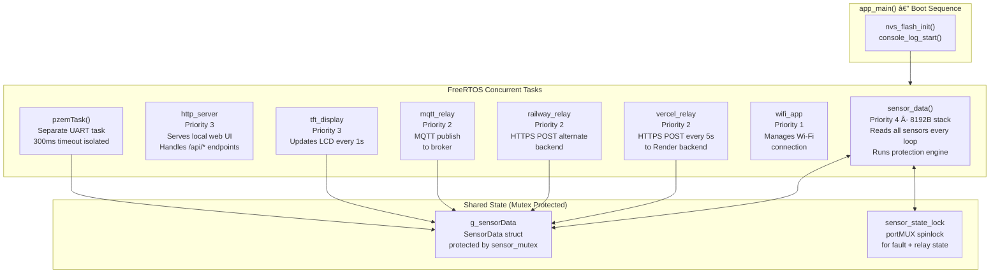

---

## 6. Motor Protection Signal Flow

```mermaid
flowchart TD
    READ["Read Sensor Data\n(every task loop)"]
    GRACE{"Startup Grace\nPeriod Active?"}
    SUPPRESS["Suppress: overcurrent\nstall · vibration"]
    CHECK["Evaluate Raw Fault Conditions"]

    OC{"Current >\nmaxCurrentA?"}
    OT{"Temp1 > maxTempC\n3 consecutive samples?"}
    ST{"RPM < minRpm AND\nCurrent > stallCurrentA?"}
    VIB{"VibrationLevel ≥ threshold\nfor trip_duration ms?"}
    OV{"Voltage > overvoltageV\n+ 2.5V hysteresis?"}
    UV{"Voltage < undervoltageV\n- 2.5V hysteresis?"}

    LATCH["Latch Fault Flags\n(portMUX critical section)"]
    NVS_SAVE["Persist to NVS Flash\n(survives reboot)"]
    COUNT{"fault_count ≥\nfaultTripCount?"}
    TRIP["Trip: Relay OFF\nBuzzer ON\nMotor Stopped"]
    CONT["Continue Running\nUpdate motor_running flag"]

    READ --> GRACE
    GRACE -->|Yes| SUPPRESS
    GRACE -->|No| CHECK
    SUPPRESS --> CHECK
    CHECK --> OC & OT & ST & VIB & OV & UV
    OC & OT & ST & VIB & OV & UV --> LATCH
    LATCH --> NVS_SAVE
    NVS_SAVE --> COUNT
    COUNT -->|Yes| TRIP
    COUNT -->|No| CONT
```

---

## 7. Cloud Relay Communication Architecture

```mermaid
graph LR
    ESP["ESP32"]

    subgraph RELAYS["Data Relay Channels (configurable, stored in NVS)"]
        VR["Vercel Relay\nHTTPS POST\nintervalSeconds=5\nAPI Key auth"]
        RR["Railway Relay\nHTTPS POST\nintervalSeconds=5\nAPI Key auth"]
        MQ["MQTT Relay\nMQTT Publish\nQoS configurable\nBroker URI + credentials"]
    end

    subgraph BACKEND["Render.com — FastAPI"]
        EP["/data endpoint\nPOST"]
    end

    subgraph CMDFLOW["Bidirectional Command Flow"]
        POLL["ESP32 polls\nGET /command/{id}/pending\nevery 5s"]
        QUEUE["commands table\nPendng → Acked\nAuto-expire 5min"]
        DASH["Dashboard\nQueues commands:\nack_faults · set_protection\nset_maintenance · reset_energy"]
    end

    ESP --> VR & RR & MQ
    VR & RR --> EP
    MQ --> EP
    DASH --> QUEUE
    POLL --> QUEUE
    QUEUE --> ESP
```

---

## 8. Backend API Architecture

```mermaid
graph TB
    subgraph FAST["FastAPI Application (app/main.py)"]
        MW["CORS Middleware\nJWT Auth Middleware"]
        subgraph ROUTERS["API Routers"]
            DR["/data — data.py\nPOST /data · GET /data/{id}\n/ai/analyze · /command/*\n/ai/local-analyze"]
            FR["/faults — faults.py\nFault lifecycle management\ncreate · resolve · delete"]
            PR["/predictions — predictions.py\nGET stored ML results"]
            FCR["/forecast — forecast.py\nLinear regression\npower/energy/cost forecast"]
            DV["/devices — devices.py\nDevice CRUD\nbulk registration"]
            AU["/auth — auth.py\nJWT login · token verify"]
        end
    end

    subgraph SVC["Services Layer"]
        PB["prediction.py\nRule-based (Tier 1)"]
        ML["ml_prediction.py\nML models (Tier 2)"]
        EN["enhanced_prediction.py\nStats + Gemini (Tier 3)"]
        ADV["advanced_ml_prediction.py\nNASA + RF + RUL (Tier 4)"]
        PRE["prebuilt_models.py\nLOF + Ridge + SVR (Tier 5)"]
        PJ["prediction_jobs.py\nDispatch: background / Redis"]
    end

    subgraph DB["PostgreSQL (Neon)"]
        SR["sensor_readings"]
        PD["predictions"]
        FL["fault_logs"]
        DV2["devices"]
        CM["commands"]
        US["users"]
    end

    DR --> PJ
    PJ --> PB & ML & ADV
    DR --> FR
    FAST --> DB
    ADV --> AI_CHAIN["Mistral → Gemini → Groq\nFallback Chain"]
```

---

## 9. ML Prediction Pipeline

```mermaid
flowchart TD
    INGEST["POST /data — Sensor Payload Received"]
    DISPATCH["prediction_jobs.py\nenqueue_prediction_job()"]
    MODE{"PREDICTION_MODE\nenv variable"}

    BASIC["Tier 1: Rule-Based\nprediction.py"]
    ML["Tier 2: ML Prediction\nml_prediction.py"]
    ADV["Tier 4: Advanced ML\nadvanced_ml_prediction.py"]

    subgraph BASIC_M["Tier 1 — Threshold Rules"]
        B1["Overheating:\navg_temp > maxTempC"]
        B2["Stall Risk:\ncurrent > stallA AND rpm < minRPM"]
        B3["Bearing Fault:\nvibration magnitude > 2.5g"]
        B4["Maintenance Due:\ntotalHours > hoursLimit"]
    end

    subgraph ML_M["Tier 2 — scikit-learn ML"]
        M1["Isolation Forest\nAnomaly Detection\ncontamination=0.1"]
        M2["Linear Regression\nTemp Forecast 6h\n72-step horizon"]
        M3["Linear Regression\nBearing Failure\nZ-score + trend"]
        M4["Polynomial Regression (deg 2)\nEfficiency Degradation"]
        M5["Rule-based Risk Scoring\nStall Risk"]
        M6["Usage Pattern Analysis\nMaintenance Prediction"]
    end

    subgraph ADV_M["Tier 4 — Advanced ML"]
        A1["Isolation Forest +\nOne-Class SVM +\nZ-score Ensemble\nAnomaly Detection"]
        A2["NASA Bearing Health Index\nRMS · Crest Factor\nKurtosis · FFT\nBearing Failure"]
        A3["Linear + Polynomial +\nMoving Average Ensemble\nAdvanced Overheating"]
        A4["Random Forest Classifier\n50 trees · Stall Risk\nFeature Importance"]
        A5["Linear + Exponential\nChange-Point Detection\nEfficiency Degradation"]
        A6["Multi-Indicator Health Index\nTemp + Vib + Current Stress\nRUL Estimation"]
    end

    subgraph STORE["Persist Results"]
        INS["INSERT INTO predictions\n(device_id, type, confidence,\nseverity, details JSONB)"]
        CLEAN["DELETE predictions > 7 days"]
    end

    INGEST --> DISPATCH
    DISPATCH --> MODE
    MODE -->|basic| BASIC --> BASIC_M
    MODE -->|ml| ML --> ML_M
    MODE -->|advanced| ADV --> ADV_M
    BASIC_M & ML_M & ADV_M --> STORE
```

---

## 10. ML Models Reference Table

### Tier 2 — `ml_prediction.py`

| Model | Library | Task | Key Parameters |
|-------|---------|------|----------------|
| **Isolation Forest** | `sklearn.ensemble` | Anomaly detection | `contamination=0.1`, `random_state=42` |
| **StandardScaler** | `sklearn.preprocessing` | Feature normalization | Default |
| **Linear Regression** | `sklearn.linear_model` | Temperature trend forecast | 72-step (6h) horizon |
| **Linear Regression** | `sklearn.linear_model` | Vibration/bearing trend | Z-score + slope analysis |
| **Polynomial Regression** | `numpy.polyfit` | Efficiency curve (degree 2) | Baseline vs. recent comparison |
| **Linear Regression** | `sklearn.linear_model` | Stall risk — efficiency trend | Decreasing efficiency flag |

### Tier 4 — `advanced_ml_prediction.py`

| Model | Library | Task | Key Parameters |
|-------|---------|------|----------------|
| **Isolation Forest** | `sklearn.ensemble` | Ensemble anomaly | `contamination=0.1` |
| **One-Class SVM** | `sklearn.svm` | Ensemble anomaly | `kernel='rbf'`, `nu=0.1` |
| **Random Forest Classifier** | `sklearn.ensemble` | Stall risk classification | `n_estimators=50`, `random_state=42` |
| **Linear Regression** | `sklearn.linear_model` | Overheating (ensemble member) | 72-step horizon |
| **Polynomial Regression** | `numpy.polyfit` | Overheating (ensemble member) | degree=2 |
| **NASA BHI** | `scipy.stats`, `scipy.signal`, `numpy.fft` | Bearing health | RMS, Crest Factor, Kurtosis, FFT |
| **Exponential Smoothing** | Custom (`α=0.3`) | Efficiency time-series | Linear + exponential ensemble |
| **RUL Estimator** | Custom | Remaining Useful Life | Temp + Vib + Current stress indicators |

### Tier 5 — `prebuilt_models.py`

| Model | Library | Task | Key Parameters |
|-------|---------|------|----------------|
| **Local Outlier Factor** | `sklearn.neighbors` | Density anomaly detection | `n_neighbors=20`, `contamination=0.1` |
| **Elliptic Envelope** | `sklearn.covariance` | Gaussian anomaly, Mahalanobis dist | `contamination=0.1` |
| **Ridge Regression** | `sklearn.linear_model` | Temperature prediction | `alpha=1.0` |
| **Lasso Regression** | `sklearn.linear_model` | Power prediction + feature selection | `alpha=0.1` |
| **Gradient Boosting Regressor** | `sklearn.ensemble` | Vibration level prediction | `n_estimators=50` |
| **SVR** | `sklearn.svm` | Efficiency prediction | `kernel='rbf'`, `C=1.0`, `gamma='scale'` |

### AI Commentary Providers

| Provider | Model | Mode | Trigger |
|----------|-------|------|---------|
| **Mistral AI** | `mistral-small` | Commentary / Prediction | Primary (tried first) |
| **Google Gemini** | `gemini-2.0-flash` | Commentary / Prediction | Fallback #2 |
| **Groq** | `llama-3.3-70b-versatile` | Commentary / Prediction | Fallback #3 |

> **Mode `commentary`**: AI provides 2–3 sentence expert commentary on ML alerts.  
> **Mode `prediction`**: AI returns structured JSON — `failure_probability_24h`, `likely_failure_mode`, `maintenance_actions`, `estimated_rul_days`.

---

## 11. Feature Engineering

```mermaid
graph LR
    subgraph RAW["Raw Sensor Inputs (per reading)"]
        R1["power (W)"]
        R2["current (A)"]
        R3["voltage (V)"]
        R4["rpm (int)"]
        R5["temp1 — Motor Temp (°C)"]
        R6["temp2 — Ambient Temp (°C)\n[Open-Meteo if not provided]"]
        R7["accel_x, accel_y, accel_z (g)"]
        R8["energy (kWh)"]
        R9["uptime_seconds"]
        R10["motor_running (bool)"]
    end

    subgraph DERIVED["Derived / Engineered Features"]
        D1["Vibration Magnitude²\n= x² + y² + z²"]
        D2["Motor Efficiency\n= RPM / Power"]
        D3["RMS (NASA)\n= √mean(vib²)"]
        D4["Crest Factor (NASA)\n= peak / RMS"]
        D5["Kurtosis (NASA)\nscipy.stats.kurtosis"]
        D6["FFT Dominant Frequency\nnumpy.fft.fft"]
        D7["Z-score\n= (x − μ) / σ"]
        D8["Efficiency Degradation\n= (baseline − recent) / baseline"]
        D9["Stress Ratio\ntemp + current + vib events / total"]
    end

    subgraph FEAT["10-D Feature Vector (per sample)"]
        FV["[power, current, voltage, rpm,\ntemp1, temp2, vib_mag², energy,\nuptime, motor_status]"]
    end

    RAW --> FEAT
    R7 --> D1 --> FV
    RAW --> DERIVED
```

**Historical Window**: 48–72 hours, up to 200 readings (Tier 2/4), 24 hours for prebuilt models.  
**Minimum samples for ML**: 10 (fallback to rules below this threshold).

---

## 12. Dataset Description

### Source
Real-time sensor data collected from a physical **single-phase induction motor** instrumented with the sensor suite described in Section 4.

### Sensor Specifications

| Sensor | Parameter | Range | Resolution |
|--------|-----------|-------|-----------|
| **PZEM-004T v3.0** | Voltage | 80–260 V AC | 0.1 V |
| | Current | 0–100 A | 0.001 A |
| | Power | 0–23000 W | 0.1 W |
| | Energy | 0–9999.9 kWh | 1 Wh |
| | Frequency | 45–65 Hz | 0.1 Hz |
| | Power Factor | 0.00–1.00 | 0.01 |
| **DS18B20** | Temperature (Motor) | −55 to +125 °C | 0.0625 °C |
| **ADXL345** | Acceleration (X/Y/Z) | ±16 g | 3.9 mg/LSB |
| | Tap Detection | Boolean | — |
| **Hall Effect Sensor** | RPM | 0–∞ | Pulse-counted |
| **Open-Meteo API** | Ambient Temperature | −∞ to +∞ °C | 0.1 °C |

### Database Schema (PostgreSQL — Neon)

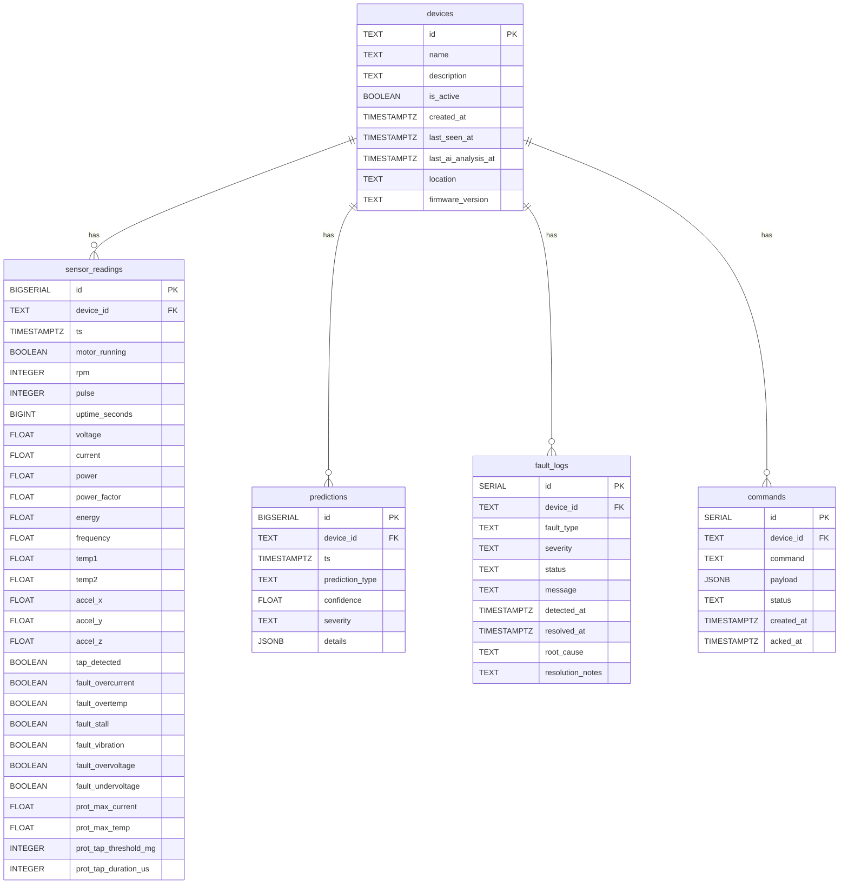

### Data Labeling Strategy
Labels are **self-supervised** — fault ground truth is derived from the hardware protection engine's threshold comparisons on the ESP32 itself. The `fault_*` boolean columns in `sensor_readings` reflect latch states written by `check_motor_protection_internal()`.

### Data Augmentation
`scripts/seed_data.py` generates realistic synthetic readings based on actual motor specifications for initial model warm-up and testing.

---

## 13. Deployment Architecture

```mermaid
graph TB
    subgraph DEV["Developer Machine"]
        CODE["Source Code\n(ESP-IDF + Python + React)"]
        ESPTOOL["esptool.py flash\n→ ESP32 via USB"]
    end

    subgraph ESP_DEPLOY["Physical Hardware"]
        ESPD["ESP32-WROOM-32\nESP-IDF v5.x\nCMake build"]
    end

    subgraph RENDER["Render.com — Backend"]
        WEB["Web Service\nuvicorn app.main:app\n--host 0.0.0.0 --port $PORT"]
        WKR2["Worker Service\npython -m app.worker\n[Redis optional]"]
    end

    subgraph NEON["Neon — Managed PostgreSQL"]
        PG["PostgreSQL 16\nSSL required\nConnection pooling\nPool recycle 300s"]
    end

    subgraph VERCEL["Vercel — Frontend"]
        VB["Vite build\nnpm run build\nSPA rewrites → index.html"]
    end

    CODE --> ESPTOOL --> ESPD
    CODE -->|git push| RENDER
    CODE -->|git push| VERCEL
    RENDER <--> NEON
    ESPD -->|HTTPS POST /data\nx-api-key header| RENDER
    VERCEL -->|REST API\nVITE_API_URL| RENDER
    RENDER -->|Open-Meteo\nambient temp fetch| OMA["Open-Meteo.com\n(no API key)"]
```

### Environment Variables

| Variable | Service | Purpose |
|----------|---------|---------|
| `DATABASE_URL` | Render | Neon PostgreSQL connection string |
| `API_KEY` | Render | Shared key (ESP32 + Frontend) |
| `GEMINI_API_KEY` | Render | Google Gemini (optional) |
| `MISTRAL_API_KEY` | Render | Mistral AI (optional) |
| `GROQ_API_KEY` | Render | Groq (optional) |
| `GEMINI_MODE` | Render | `commentary` / `prediction` / `disabled` |
| `PREDICTION_MODE` | Render | `basic` / `ml` / `advanced` |
| `PREDICTION_DISPATCH_MODE` | Render | `auto` / `background` / `redis` |
| `REDIS_URL` | Render | Optional Redis for worker queue |
| `VITE_API_URL` | Vercel | Render backend URL |
| `VITE_API_KEY` | Vercel | Same shared API key |

---

## 14. Frontend Dashboard Architecture

```mermaid
graph TB
    subgraph APP["React App (src/App.jsx)"]
        AUTH["Auth Guard\nJWT token check\nisAuthenticated()"]
        LOGIN["LoginPage\nJWT login flow"]
        HOME["Home.jsx\nDevice list · Search\nAdd / Bulk Add"]
    end

    subgraph DEVICE["Per-Device Layout (DeviceLayout.jsx)"]
        NAV["Tab Navigation"]
        OV["Overview.jsx\nGauges · Mini charts\nQuick metrics · AI summary"]
        PW["PowerPage.jsx\nVoltage · Current · PF\nEnergy charts"]
        TP["TemperaturePage.jsx\nMotor temp · Ambient temp\nTrend charts"]
        VB["VibrationPage.jsx\nX/Y/Z acceleration\nTap detection"]
        FP["FaultsPage.jsx\nFault lifecycle\nResolve · Root cause"]
        AI["AIPage.jsx\nML predictions\nOn-demand AI analysis"]
        ST["SettingsPage.jsx\nProtection thresholds\nMaintenance config\nCSV export"]
        TM["TerminalPage.jsx\nRaw JSON view\nCommand history"]
    end

    subgraph API["api.js — Frontend API Wrapper"]
        A1["fetchLatestData()"]
        A2["fetchPredictions()"]
        A3["triggerAIAnalysis()"]
        A4["sendCommand()"]
        A5["exportSensorCSV()\nexportFaultLogsCSV()"]
    end

    AUTH --> HOME
    AUTH --> LOGIN
    HOME --> DEVICE
    NAV --> OV & PW & TP & VB & FP & AI & ST & TM
    APP --> API
```

---

## 15. Technology Stack Summary

| Layer | Technology | Version | Purpose |
|-------|-----------|---------|---------|
| **Microcontroller** | ESP32-WROOM-32 | — | Edge data collection & control |
| **Firmware Framework** | ESP-IDF | v5.x | FreeRTOS, peripherals, NVS, HTTP |
| **Build System** | CMake | — | Firmware compilation |
| **Power Sensor** | PZEM-004T | v3.0 | Electrical measurements |
| **Temp Sensor** | DS18B20 | — | Motor temperature |
| **Vibration Sensor** | ADXL345 | — | 3-axis acceleration + tap |
| **RPM Sensor** | Hall Effect | — | Magnetic pulse counting |
| **Backend Framework** | FastAPI | latest | REST API, async, OpenAPI |
| **ASGI Server** | Uvicorn | standard | Production HTTP server |
| **ORM / DB Driver** | SQLAlchemy Async + asyncpg | — | PostgreSQL async access |
| **Database** | PostgreSQL (Neon) | 16 | Managed cloud database |
| **ML Library** | scikit-learn | latest | All ML models |
| **Numerical** | NumPy, SciPy | latest | Arrays, FFT, statistics |
| **AI — Primary** | Mistral AI (`mistral-small`) | — | Expert commentary |
| **AI — Secondary** | Google Gemini (`gemini-2.0-flash`) | — | Fallback AI |
| **AI — Tertiary** | Groq (`llama-3.3-70b-versatile`) | — | Fallback AI |
| **Job Queue** | Redis (optional) | — | Out-of-process ML workers |
| **Authentication** | JWT (python-jose + bcrypt) | — | User login + token auth |
| **Frontend Framework** | React | 19 | Dashboard SPA |
| **Build Tool** | Vite | 8 | Fast dev + production build |
| **Charting** | Chart.js / react-chartjs-2 | — | Telemetry visualization |
| **Icons** | Lucide React | — | UI icons |
| **Frontend Hosting** | Vercel | — | SPA CDN deployment |
| **Backend Hosting** | Render.com | — | FastAPI + worker services |
| **Ambient Temp API** | Open-Meteo | — | Free weather API (no key) |
