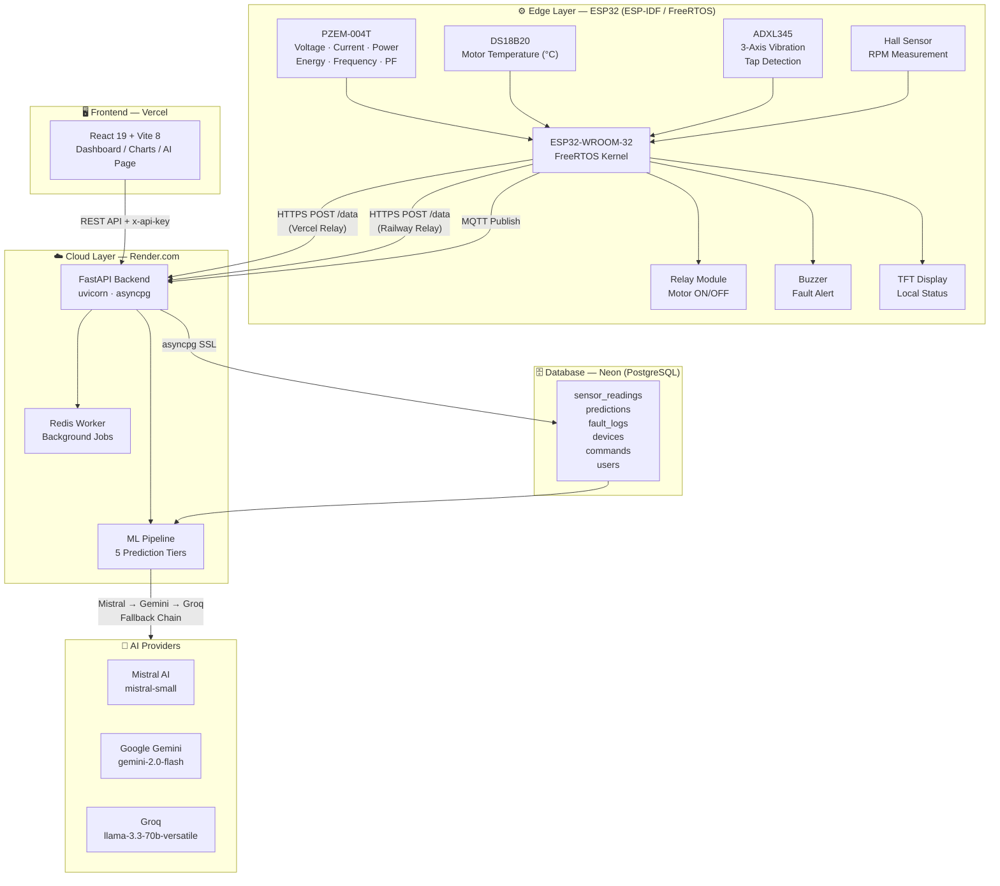
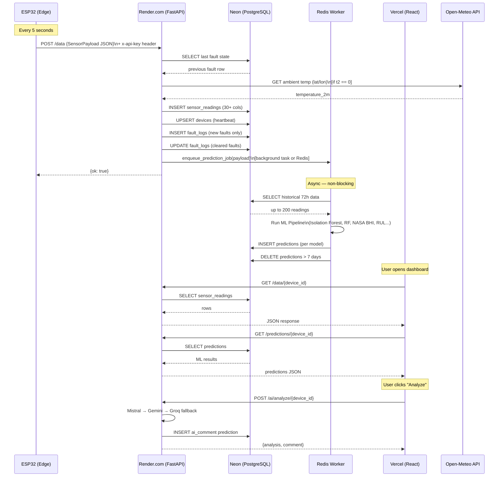
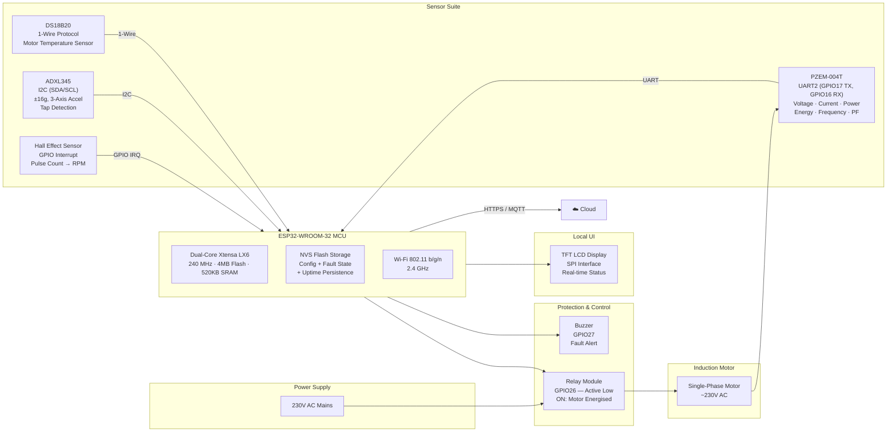
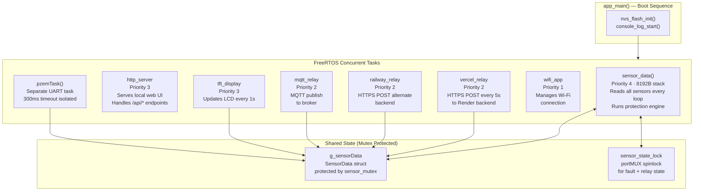
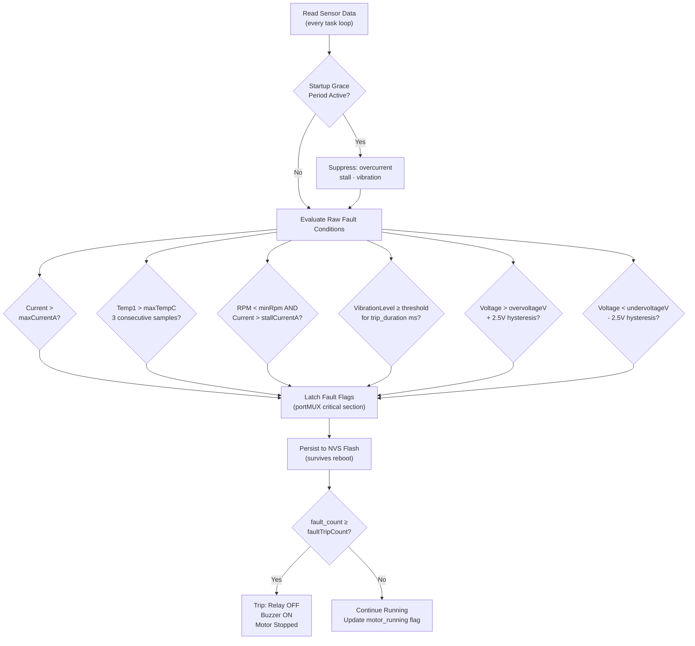
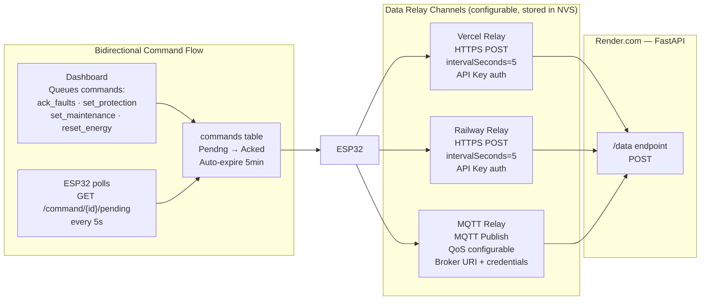
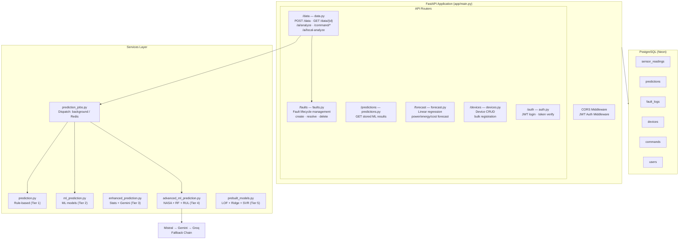

# ESP32-Based Smart Motor Retrofit and Monitoring System
### Final Year Project — Technical Report

---

## 1. System Overview

This project implements a full-stack IoT system for **real-time motor health monitoring and predictive maintenance**. A physical ESP32 microcontroller collects electrical and mechanical sensor data from a motor, relays it over Wi-Fi to a cloud backend, stores it in a managed PostgreSQL database (Neon), and exposes it through a React dashboard hosted on Vercel. Machine learning models running on the backend continuously predict faults, degradation, and remaining useful life.

---

## 2. High-Level System Architecture

---

## 3. Data Flow: ESP32 → Render → Neon → Vercel

---

## 4. Hardware Block Diagram

---

## 5. ESP32 Firmware Architecture (FreeRTOS Tasks)

---

## 6. Motor Protection Signal Flow

---

## 7. Cloud Relay Communication Architecture

---

## 8. Backend API Architecture

