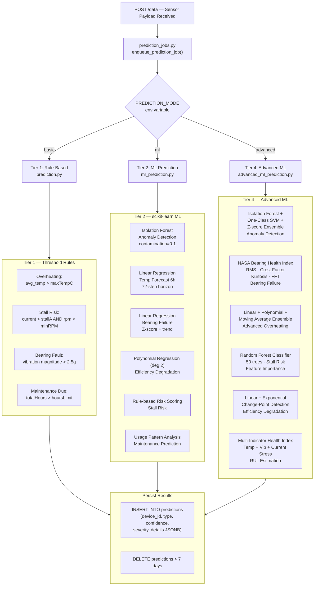
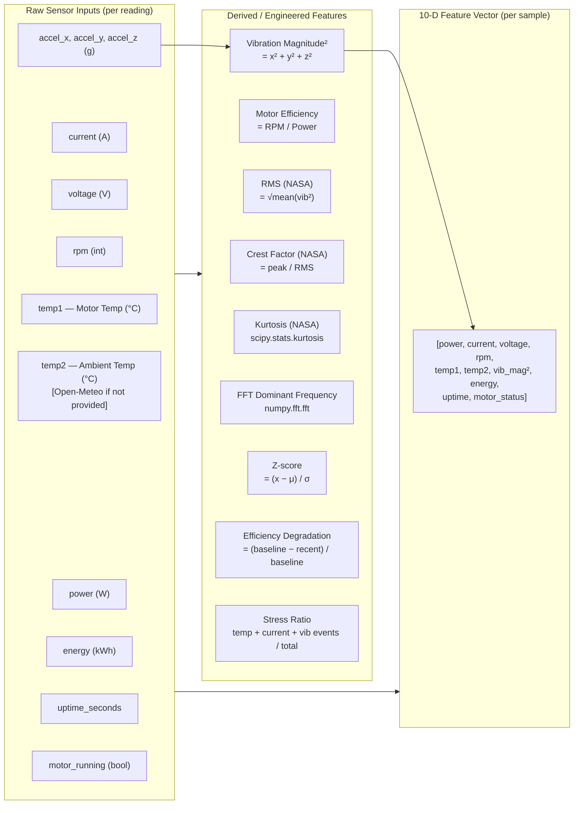
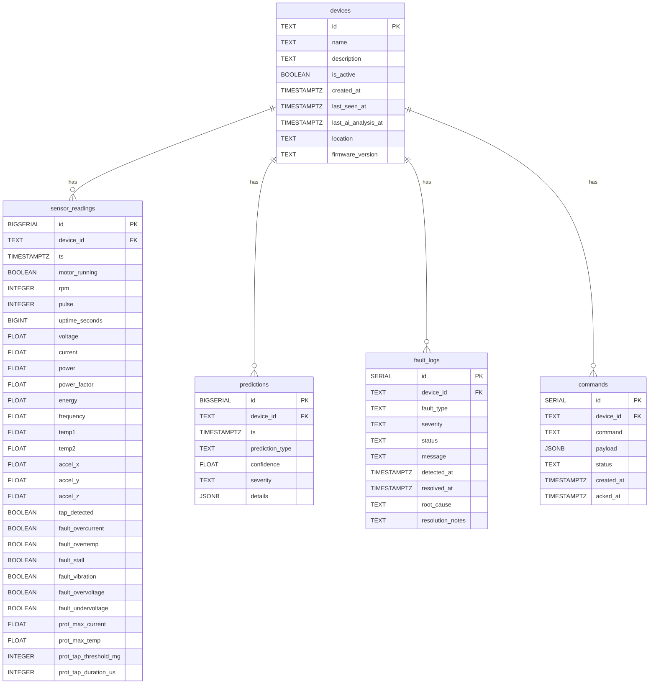
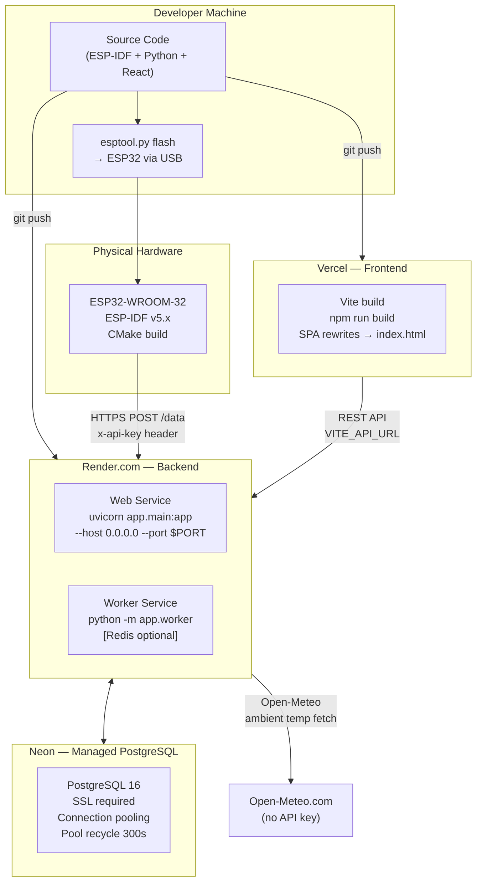
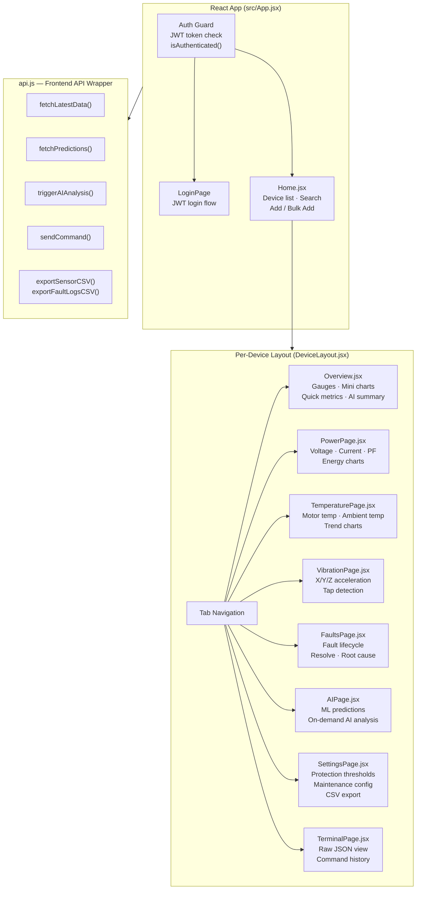

---

## 9. ML Prediction Pipeline

---

## 10. ML Models Reference Table

### Tier 2 — `ml_prediction.py`

| Model | Library | Task | Key Parameters |
|-------|---------|------|----------------|
| **Isolation Forest** | `sklearn.ensemble` | Anomaly detection | `contamination=0.1`, `random_state=42` |
| **StandardScaler** | `sklearn.preprocessing` | Feature normalization | Default |
| **Linear Regression** | `sklearn.linear_model` | Temperature trend forecast | 72-step (6h) horizon |
| **Linear Regression** | `sklearn.linear_model` | Vibration/bearing trend | Z-score + slope analysis |
| **Polynomial Regression** | `numpy.polyfit` | Efficiency curve (degree 2) | Baseline vs. recent comparison |
| **Linear Regression** | `sklearn.linear_model` | Stall risk — efficiency trend | Decreasing efficiency flag |

### Tier 4 — `advanced_ml_prediction.py`

| Model | Library | Task | Key Parameters |
|-------|---------|------|----------------|
| **Isolation Forest** | `sklearn.ensemble` | Ensemble anomaly | `contamination=0.1` |
| **One-Class SVM** | `sklearn.svm` | Ensemble anomaly | `kernel='rbf'`, `nu=0.1` |
| **Random Forest Classifier** | `sklearn.ensemble` | Stall risk classification | `n_estimators=50`, `random_state=42` |
| **Linear Regression** | `sklearn.linear_model` | Overheating (ensemble member) | 72-step horizon |
| **Polynomial Regression** | `numpy.polyfit` | Overheating (ensemble member) | degree=2 |
| **NASA BHI** | `scipy.stats`, `scipy.signal`, `numpy.fft` | Bearing health | RMS, Crest Factor, Kurtosis, FFT |
| **Exponential Smoothing** | Custom (`α=0.3`) | Efficiency time-series | Linear + exponential ensemble |
| **RUL Estimator** | Custom | Remaining Useful Life | Temp + Vib + Current stress indicators |

### Tier 5 — `prebuilt_models.py`

| Model | Library | Task | Key Parameters |
|-------|---------|------|----------------|
| **Local Outlier Factor** | `sklearn.neighbors` | Density anomaly detection | `n_neighbors=20`, `contamination=0.1` |
| **Elliptic Envelope** | `sklearn.covariance` | Gaussian anomaly, Mahalanobis dist | `contamination=0.1` |
| **Ridge Regression** | `sklearn.linear_model` | Temperature prediction | `alpha=1.0` |
| **Lasso Regression** | `sklearn.linear_model` | Power prediction + feature selection | `alpha=0.1` |
| **Gradient Boosting Regressor** | `sklearn.ensemble` | Vibration level prediction | `n_estimators=50` |
| **SVR** | `sklearn.svm` | Efficiency prediction | `kernel='rbf'`, `C=1.0`, `gamma='scale'` |

### AI Commentary Providers

| Provider | Model | Mode | Trigger |
|----------|-------|------|---------|
| **Mistral AI** | `mistral-small` | Commentary / Prediction | Primary (tried first) |
| **Google Gemini** | `gemini-2.0-flash` | Commentary / Prediction | Fallback #2 |
| **Groq** | `llama-3.3-70b-versatile` | Commentary / Prediction | Fallback #3 |

> **Mode `commentary`**: AI provides 2–3 sentence expert commentary on ML alerts.  
> **Mode `prediction`**: AI returns structured JSON — `failure_probability_24h`, `likely_failure_mode`, `maintenance_actions`, `estimated_rul_days`.

---

## 11. Feature Engineering

**Historical Window**: 48–72 hours, up to 200 readings (Tier 2/4), 24 hours for prebuilt models.  
**Minimum samples for ML**: 10 (fallback to rules below this threshold).

---

## 12. Dataset Description

### Source
Real-time sensor data collected from a physical **single-phase induction motor** instrumented with the sensor suite described in Section 4.

### Sensor Specifications

| Sensor | Parameter | Range | Resolution |
|--------|-----------|-------|-----------|
| **PZEM-004T v3.0** | Voltage | 80–260 V AC | 0.1 V |
| | Current | 0–100 A | 0.001 A |
| | Power | 0–23000 W | 0.1 W |
| | Energy | 0–9999.9 kWh | 1 Wh |
| | Frequency | 45–65 Hz | 0.1 Hz |
| | Power Factor | 0.00–1.00 | 0.01 |
| **DS18B20** | Temperature (Motor) | −55 to +125 °C | 0.0625 °C |
| **ADXL345** | Acceleration (X/Y/Z) | ±16 g | 3.9 mg/LSB |
| | Tap Detection | Boolean | — |
| **Hall Effect Sensor** | RPM | 0–∞ | Pulse-counted |
| **Open-Meteo API** | Ambient Temperature | −∞ to +∞ °C | 0.1 °C |

### Database Schema (PostgreSQL — Neon)

### Data Labeling Strategy
Labels are **self-supervised** — fault ground truth is derived from the hardware protection engine's threshold comparisons on the ESP32 itself. The `fault_*` boolean columns in `sensor_readings` reflect latch states written by `check_motor_protection_internal()`.

### Data Augmentation
`scripts/seed_data.py` generates realistic synthetic readings based on actual motor specifications for initial model warm-up and testing.

---

## 13. Deployment Architecture

### Environment Variables

| Variable | Service | Purpose |
|----------|---------|---------|
| `DATABASE_URL` | Render | Neon PostgreSQL connection string |
| `API_KEY` | Render | Shared key (ESP32 + Frontend) |
| `GEMINI_API_KEY` | Render | Google Gemini (optional) |
| `MISTRAL_API_KEY` | Render | Mistral AI (optional) |
| `GROQ_API_KEY` | Render | Groq (optional) |
| `GEMINI_MODE` | Render | `commentary` / `prediction` / `disabled` |
| `PREDICTION_MODE` | Render | `basic` / `ml` / `advanced` |
| `PREDICTION_DISPATCH_MODE` | Render | `auto` / `background` / `redis` |
| `REDIS_URL` | Render | Optional Redis for worker queue |
| `VITE_API_URL` | Vercel | Render backend URL |
| `VITE_API_KEY` | Vercel | Same shared API key |

---

## 14. Frontend Dashboard Architecture

---

## 15. Technology Stack Summary

| Layer | Technology | Version | Purpose |
|-------|-----------|---------|---------|
| **Microcontroller** | ESP32-WROOM-32 | — | Edge data collection & control |
| **Firmware Framework** | ESP-IDF | v5.x | FreeRTOS, peripherals, NVS, HTTP |
| **Build System** | CMake | — | Firmware compilation |
| **Power Sensor** | PZEM-004T | v3.0 | Electrical measurements |
| **Temp Sensor** | DS18B20 | — | Motor temperature |
| **Vibration Sensor** | ADXL345 | — | 3-axis acceleration + tap |
| **RPM Sensor** | Hall Effect | — | Magnetic pulse counting |
| **Backend Framework** | FastAPI | latest | REST API, async, OpenAPI |
| **ASGI Server** | Uvicorn | standard | Production HTTP server |
| **ORM / DB Driver** | SQLAlchemy Async + asyncpg | — | PostgreSQL async access |
| **Database** | PostgreSQL (Neon) | 16 | Managed cloud database |
| **ML Library** | scikit-learn | latest | All ML models |
| **Numerical** | NumPy, SciPy | latest | Arrays, FFT, statistics |
| **AI — Primary** | Mistral AI (`mistral-small`) | — | Expert commentary |
| **AI — Secondary** | Google Gemini (`gemini-2.0-flash`) | — | Fallback AI |
| **AI — Tertiary** | Groq (`llama-3.3-70b-versatile`) | — | Fallback AI |
| **Job Queue** | Redis (optional) | — | Out-of-process ML workers |
| **Authentication** | JWT (python-jose + bcrypt) | — | User login + token auth |
| **Frontend Framework** | React | 19 | Dashboard SPA |
| **Build Tool** | Vite | 8 | Fast dev + production build |
| **Charting** | Chart.js / react-chartjs-2 | — | Telemetry visualization |
| **Icons** | Lucide React | — | UI icons |
| **Frontend Hosting** | Vercel | — | SPA CDN deployment |
| **Backend Hosting** | Render.com | — | FastAPI + worker services |
| **Ambient Temp API** | Open-Meteo | — | Free weather API (no key) |
